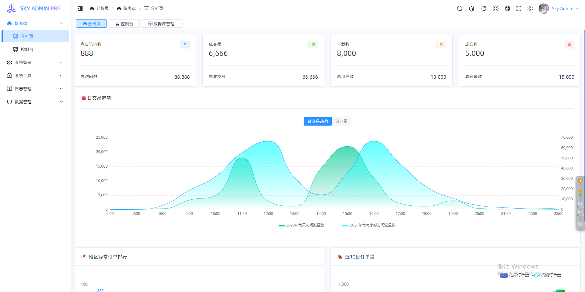
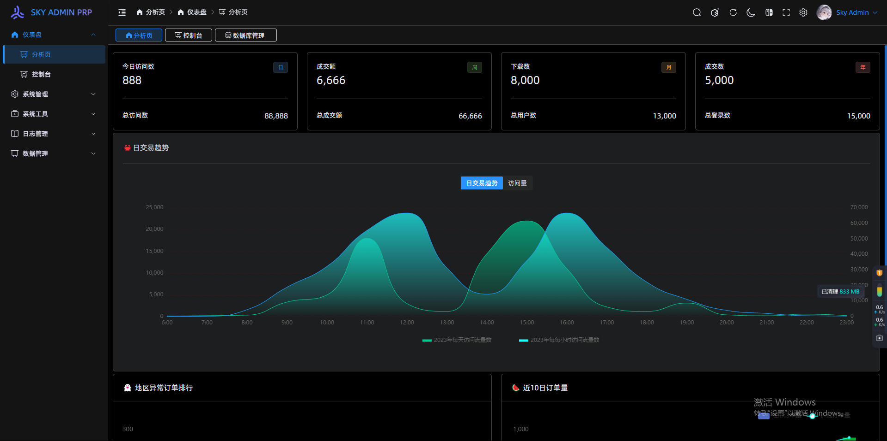
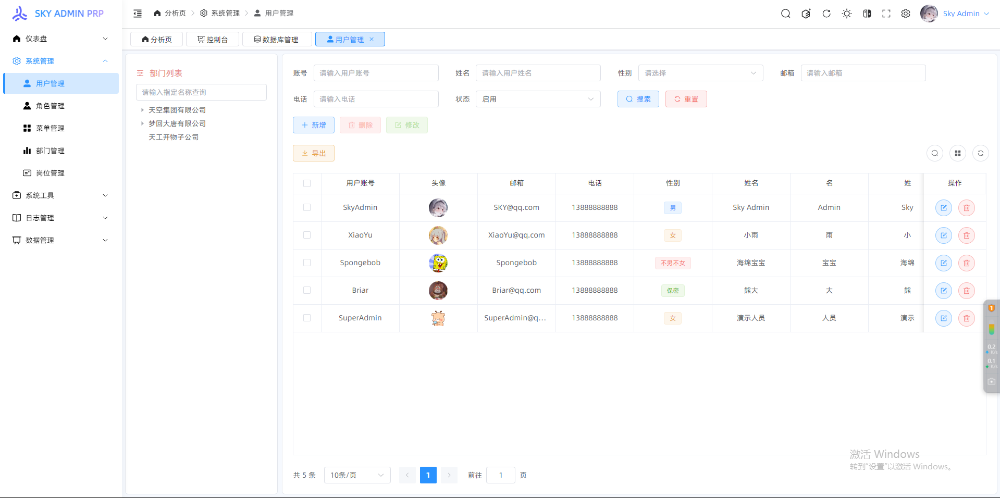
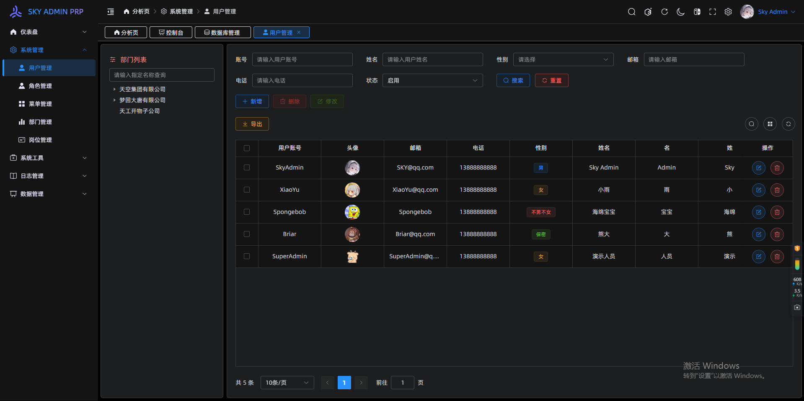
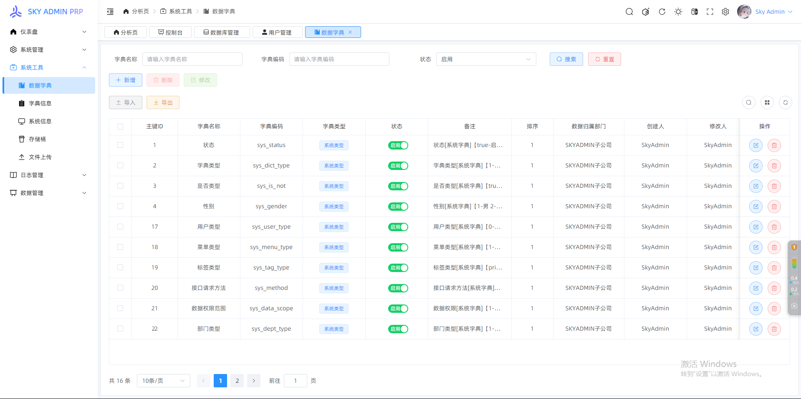
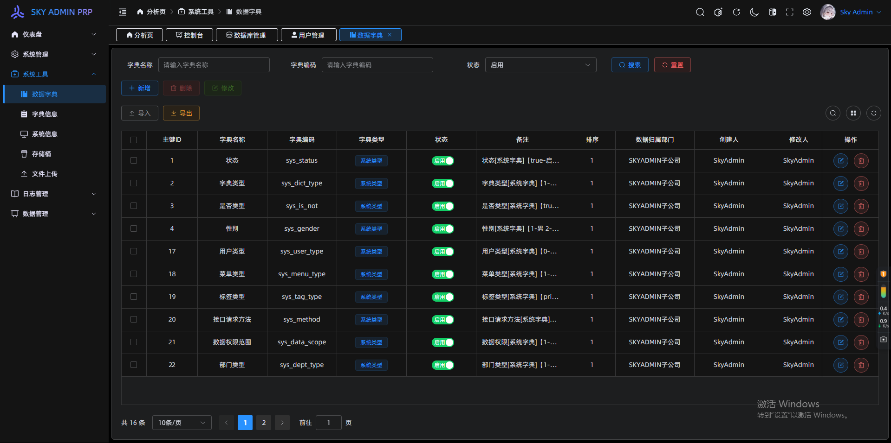
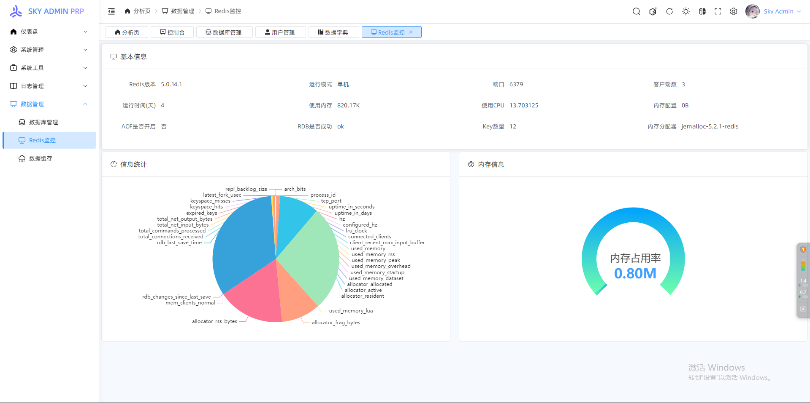
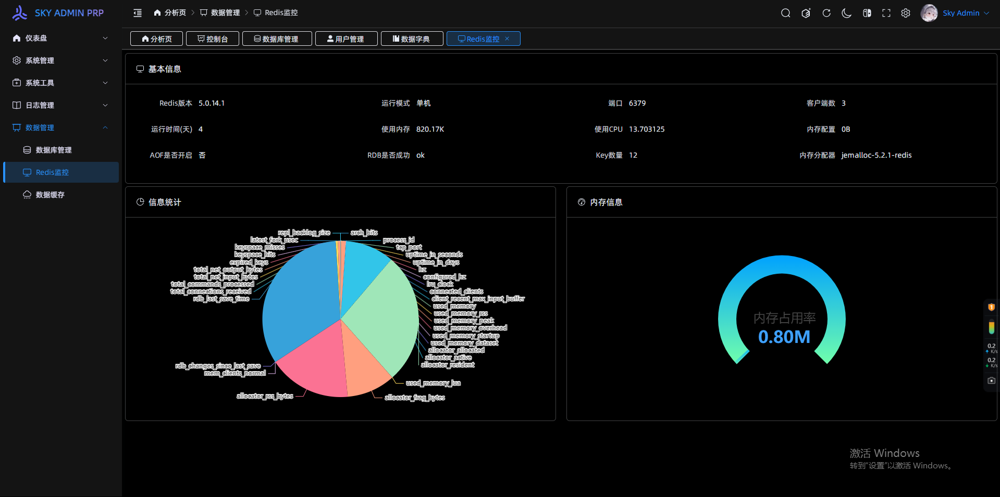

<p align="center">
  
</p>

<h1 align="center">CAREFUL-UI🌻</h1>

<p align="center">一款<b>开箱即用</b>的 Vue3 中后台管理系统框架[纯前端]</p>

<p align="center">
  <span>&nbsp;[&nbsp;</span>
  纯前端演示[开源]
  <a href="https//admin.careful.com/" target="_blank">点击这里</a>
  <span>&nbsp;]&nbsp;</span>
<p>

## 1、简介

CAREFUL-UI🌻 是一款开源企业级别的中后台管理平台模板，基于【KOI_UI 二次开发】 Vue3、Vite、TypeScript、Pinia、Pinia持久化插件、Unocss 和 ElementPlus等前端最新技术栈。相较于其他比较流行的后台管理模板，更加简洁、快捷和容易理解，对萌新小白十分友好。非常适合企业级项目、中小型项目、个人项目以及毕业设计。

## 2、特点

- 🎯 使用 Element Plus + Vite + Vue3 + TypeScript + Uncoss + Pinia 等主流技术。
- 🍊 多种布局和丰富的主题适配移动端、IPad和PC端。
- 🎃 封装按钮和Input框的防抖、限流和背景水印以及左侧无限递归菜单。
- 🍀 集成 `pinia`，vuex 的替代方案，轻量、简单、易用，并且配置pinia持久化插件。
- 😍 二次封装Dialog对话框、Drawer抽屉、Notification通知、Message消息提示和Popconfirm确认框，操作更加方便快捷。
- 🍓 二次封装axios，方便接口更好的统一管理。
- 🌍 集成Echarts图表。
- 🌈 集成 `unocss`，antfu 开源的原子 css 解决方案，非常轻量。
- 🐼 内置权限管理页面，将权限细分为5个主要权限依次管理数据的安全以及准确性。
- 🏡 集成 `iconify` 图标，支持自定义 svg 图标, 优雅使用icon。

## 3、无需递归路由

众所周知，在实现左侧无限递归路由的时候，后端需要进行树形递归，前端再二次进行递归处理，这样增加了前后端开发难度，如何解决如下？

此项目，前端使用扁平化路由，实现三级及以上页面依旧存在路由缓存效果。

后端提供接口菜单不需要再进行递归，直接根据提供的json格式，进行提供接口[数据如下]，简化后端难度，实现无限递归路由。

```properties
{
  "status": 200,
  "msg": "操作成功🌻",
  "data": [
    {
      "id": 1,
      "sort": 1,
      "creator": "CAREFULAdmin",
      "modifier": "CAREFULAdmin",
      "belong_dept": 2,
      "remark": null,
      "status": true,
      "create_time": "2024-10-25 00:10:47",
      "update_time": "2024-10-25 00:10:50",
      "parent_id": null,
      "type": 1,
      "icon": "HomeFilled",
      "title": "仪表盘",
      "permission": "dashboard",
      "name": "dashboard",
      "component": null,
      "api": null,
      "method": null,
      "path": "/dashboard",
      "redirect": "/dashboard/analysis",
      "isHide": false,
      "isLink": null,
      "isKeepAlive": false,
      "isFull": false,
      "isAffix": false
    },
    {
      "id": 2,
      "sort": 1,
      "creator": "CAREFULAdmin",
      "modifier": "CAREFULAdmin",
      "belong_dept": 2,
      "remark": null,
      "status": true,
      "create_time": "2024-10-25 00:14:59",
      "update_time": "2024-10-25 00:15:02",
      "parent_id": 1,
      "type": 2,
      "icon": "DataAnalysis",
      "title": "分析页",
      "permission": "dashboard:analysis",
      "name": "analysis",
      "component": "dashboard/analysis/index",
      "api": null,
      "method": null,
      "path": "/dashboard/analysis",
      "redirect": null,
      "isHide": false,
      "isLink": null,
      "isKeepAlive": true,
      "isFull": false,
      "isAffix": true
    },
    "success": true
}
```

## 4、预览

> 预览截图

<table>
  <tr>
    <td></td>
    <td></td>
  </tr>
  <tr>
    <td></td>
    <td></td>
  </tr>
  <tr>
    <td></td>
    <td></td>
  </tr>
  <tr>
    <td></td>
    <td></td>
  </tr>
</table>

## 5、支持

如果觉得 CAREFUL-ADMIN🌻这个框架不错，或者已经在使用了，希望你可以在 **Github** 或者 **Gitee(码云)** 帮我点个 ⭐ ，这将对我是极大的鼓励。

## 6、快速开始

```properties
# 若未配置pnpm，请先下载并配置镜像
npm install pnpm -g --registry=https://registry.npmmirror.com
# 下载依赖
pnpm install
# 启动
pnpm run dev
```

## 7、打包发布

```properties
# 构建环境
pnpm build
# 生产环境
pnpm build:prod
```

## 8、源码

<p align="left">
  <span>&nbsp;[&nbsp;</span>
  Gitee仓库
  <a href="https://gitee.com/BigCatHome/koi-ui.git" target="_blank">点击这里</a>
  <span>&nbsp;]&nbsp;</span>
<p>
